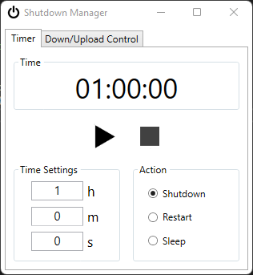
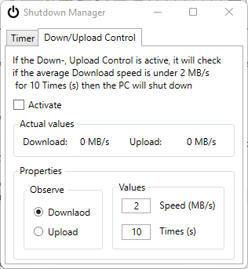

# ShutdownManager

ShutdownManager is a little tool to manage the time when the PC should shut down, go in Sleep Mode or Restart the PC.

Features include:

- You can choose between Sleep Mode, Restart or ShutdownManager
- The timer can be set precisely
- The configuration will be safed in a json-file. If you open the tool again, the configuration will be reloaded, when a json-file exist
- You can press some button to stop, pause or to play the timer
- For every action, you get some balloon tip
- You can also shut down your PC by observing your Down/Upload speed. 
- If you want, you can add the tool to the startup, by pressing the button in the Taskbar.
- When its added to startup and you close the MainWindow, it is still running in the Taskbar.
- The time and speed which controlls the shutdown time can be adjusted.

## Screenshots

    
	

